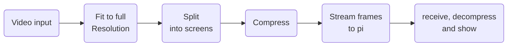

# VideoWall-OCV A video wall made of monitors
This project is built in opencv, using raspberry pi 4's. The pi's are clients that get a video stream, and display it on their monitor.
the monitors are `1280x1024` resolution. The main video stream is started and captured on a server.
> in this case, an old 2009-2012 pc, running ubuntu.

   on this server, the video pipeline is implemented like this:


So we will run through these steps one at a time now.

## Video input

The video input is currently being handled by opencv, because of the amount of input types. This means videostreams, like http, rtsp, mp4, webcams, etc.. 
it looks like this:
```python
import cv2
cap = cv2.VideoCapture(0, cv2.CAP_DSHOW)
```

> explain libary video selector

## Video fitting

now the video needs to be fit to the max size it can be on the displays. We can do this by checking if it is wider than the aspect ratio or not, like this:
```python
if aspect_ratio > target_width / target_height:
    # pad top and bottom
else:
    # pad right and left
```
Then we call a simple `cv2.resize()`, and a `cv2.copyMakeBorder()`.

## Video Splitting

The video needs to be split into the multiple frames to then send as a whole. So we will look at the splitting of the image now.
first, the wall is 4 displays wide, and 3 displays high.
```python
# Iterate over the subframes grid
    for i in range(3):
        for j in range(4):
            # Calculate the coordinates of the subframe
            x = j * frame_width
            y = i * frame_height

            # Extract the subframe from the downscaled frame
            global_subframes[i][j] = downscaled_frame[y:y+frame_height, x:x+frame_width]

            # Create a thread to send the subframe
            thread = threading.Thread(target=send_subframe, args=(i, j))
            threads.append(thread)
            thread.start()
```  
## Video Compression  
Currently, video compression is handled by downscaling the frame. Downscaling involves reducing the resolution of the video, which helps decrease the amount of data needed for transmission as this is our biggest limitation. We have also tried implementing JPEG encoding as a compression method, which worked well for one or two video streams. However, when applied to our 12 streams, it caused synchronization and latency issues. Therefore, we opted to go with downscaling an upscaling for now, as it avoids these problems while still reducing bandwidth.

## Video Streaming
The Video streaming is handled via [ImageZMQ](https://github.com/jeffbass/imagezmq) thanks to `jeffbass`.  This was previously handled by an http stream, and rtsp was also tried. This did not work because http is a tcp stream, and really slows down the system because it expects a reply from each of the players.

in Video Splitting we launch this thread:
```python
def send_subframe(i, j):
    senders[i][j].send_image(rpi_name, global_subframes[i][j])
```

## Video Displaying  
For displaying video, the process involves capturing the video stream via [ImageZMQ](https://github.com/jeffbass/imagezmq) library. Upscaling the image to the native resolution of the screen, and displaying it via OpenCV2.  

> **Note:** When running the application from a terminal, add `DISPLAY=:0` to ensure the video appears on the screen. Without this, it will throw a Wayland error.
The video streaming is started using systemd. this starts a shell on the desktop called `client.sh` you can start the installation and start up systemd with this 


## //TODO  

- **Compression:** Currently, only downscaling is used, but it would be beneficial to investigate different compression methods since we are bandwidth-limited.  
- **Bezel Correction:** Improving the alignment and visual quality of displays by adjusting for bezels, enhancing the viewing experience.  
- **Fixed IPs for Clients:** Assigning fixed IPs for clients to streamline network management and reduce potential connectivity issues.  
- **UI for the Server:** Creating a user interface for the server to improve usability and make management easier.